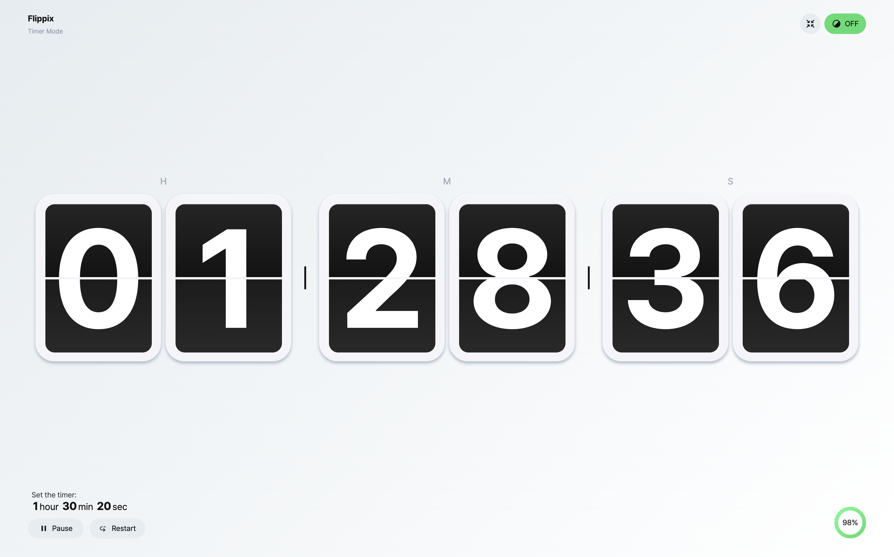

# Flippix

> **Deploy:** [flippix-clock.vercel.app/](https://flippix-clock.vercel.app/)

**Flip + Pixel**의 합성어로, 아날로그 플립 시계를 디지털로 구현한 Svelte 5 기반 토이 프로젝트입니다.
**Svelte 5 학습을 목적**으로, 모듈화와 상태 관리, 애니메이션, 상호작용 등을 경험하며 개발했습니다.


<br/>

## 📦 개발 환경

- **Framework**: Svelte 5 + SvelteKit
- **Language**: TypeScript
- **Style**: SCSS
- **State Management**: Svelte Store

<br/>

## ✨ 주요 기능

### 시계 모드
- 현재 시간을 디지털 플립 시계 스타일로 실시간 표시합니다.
### 타이머 모드
- URL Query string으로 타이머 시간을 설정합니다.
  - 예: `?timer=1:30:20` → 1시간 30분 20초
  - 일시정지(Pause), 재개(Resume), 재시작(Restart) 기능을 지원합니다.
  - 타임오버 시 재시작 또는 시계 모드로 전환할 수 있습니다.
 ### 부가 기능
 - 전체화면 모드 지원
    - 버튼 클릭으로 전체화면으로 확장할 수 있습니다.
    - 전체화면 모드 사용 시 정보성 UI 요소나 로고 등을 노출하지 않습니다.
- 진행률 상태 표시(progress bar)
  - 타이머 모드 사용 시 현재 진행률을 표시합니다.
- 버튼 인터랙션 사운드 효과
  - 주요 액션(일시정지/재개/재시작) 시 사운드 효과를 제공합니다.
- 라이트 / 다크 테마 전환 (브라우저 기본 테마 감지)
  - 사용자 설정에 따라 테마를 변경할 수 있으며, `prefers-color-scheme`를 자동으로 감지합니다.
- Toast 메세지 알림
  - 상태 변화나 완료 이벤트 발생 시 알림 메세지를 제공합니다.

<br/>

## 📁 주요 코드 / 파일 구조


| 파일명                          | 역할                                    |
| :---------------------------- | :-------------------------------------- |
| `routes/+page.svelte`        | 메인 페이지, 시계/타이머 전환 및 UI 구성             |
| `stores/timeStore.ts`      | 타이머 상태 관리 (현재 시간, 진행률, 실행 상태, 타이머 동작 함수) |
| `stores/themeStore.ts`   | 라이트/다크테마 상태 관리, localStorage 및 prefers-color-scheme 연동        |
| `stores/toastStore.ts`           | 토스트 메시지 상태 관리 및 제어 (Toast 생성, 성공/오류/정보 등 케이스 제공) |
| `stores/fullscreenStore.ts` | 전체화면 상태 관리 및 토글 함수 제공        |
| `types`      |  공통 타입 정의 (예:`Time`) |
| `utils`          | toSeconds, toTimeObject 등 시간 처리 관련 유틸 함수 |
| `components`    | 버튼 클릭 시 전체화면 진입/해제         |

<br/>

## 🎨 UI / UX 요소

- 플립 애니메이션: 숫자 변경 시 자연스럽게 뒤집히는 효과
- 토스트 메시지: 주요 상태 변화 (예: 모드 전환, 타임오버) 알림
- 사운드 효과: 사용자 행동에 따라 반응성 있는 음향 피드백
- 모드 전환 안내: 시계 모드 ←→  타이머 모드 간 전환 및 URL query string 안내
- 반응형 레이아웃 및 다크/라이트 테마 지원

<br/>

## 👩‍💻 기술적 특징

- Svelte store로 상태 관리 (`writable` 사용)
- query string 기반 동작 설계로 URL만으로 특정 모드 접근 가능
- prefers-color-scheme 감지로 사용자 기본 테마 맞춤 적용
- 중복 코드 리팩토링 및 컴포넌트/스토어 분리로 유지보수성 강화

<br/>

## 💻 스크린샷

|                  시계 모드 (Clock Mode)                   |                                                       타이머 모드 (Timer Mode)                                                        |
| :-------------------------------------------------------: | :-----------------------------------------------------------------------------------------------------------------------------------: |
|  |  <br/> 타이머 모드에서는 진행률, 일시정지/재개/재시작 컨트롤러를 제공합니다. |

|                                                 타이머 종료(Timeover)                                                 |                                            다크 모드 (Dark Mode)                                             | 전체화면 모드 (Fullscreen Mode)                                                                                         |
| :-------------------------------------------------------------------------------------------------------------------: | :----------------------------------------------------------------------------------------------------------: | ----------------------------------------------------------------------------------------------------------------------- |
|  <br/> 타이머 종료 시 재시작, 시계모드 전환 버튼을 제공합니다. |  <br/> 우측 상단 토글 버튼을 통해 전환할 수 있습니다. |  <br/> 전체화면에서는 정보성 UI나 로고 등을 미노출합니다. |

|                                                            가이드 (Guide)                                                            |                                                    Toast Message                                                    |
| :----------------------------------------------------------------------------------------------------------------------------------: | :-----------------------------------------------------------------------------------------------------------------: |
|  <br/> 시계모드에서는 타이머로 전환하는 가이드(호버시 노출)를 제공합니다. |  <br/> 버튼 클릭 시 화면의 하단에 Toast 메세지를 제공합니다. |

<br/>

## 🏃 프로젝트 실행

```bash
# 의존성 설치
npm install

# 개발 서버 실행
npm run dev

# 배포용 빌드
npm run build

```

<br/>

## ⚙️ 타이머 설정 방법

URL에 `?timer=1:30:00` 과 같은 Query String을 추가하여 타이머를 설정할 수 있습니다.

예시: `https://flippix-clock.vercel.app/?timer=1:30:00`

<br/>

## ✏️ TODO

- [ ] 추후 타이머 설정 인터페이스 제작 고려
- [ ] 코드 리팩토링
