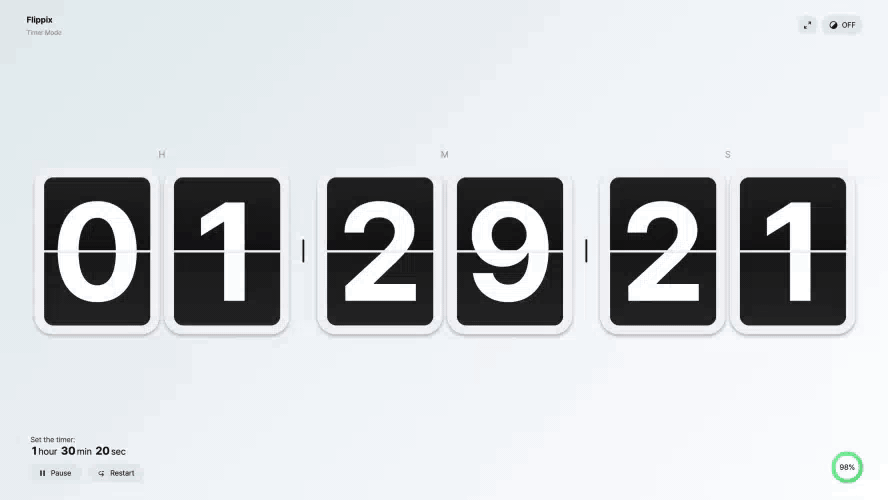
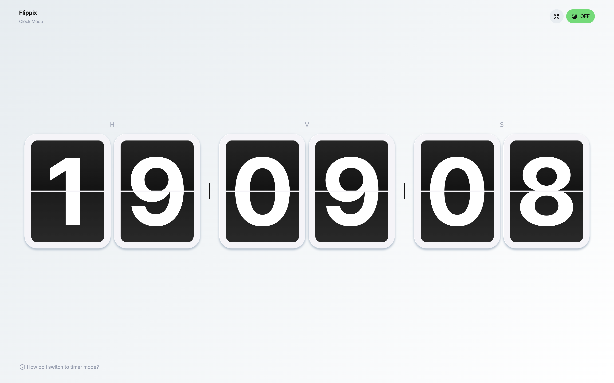
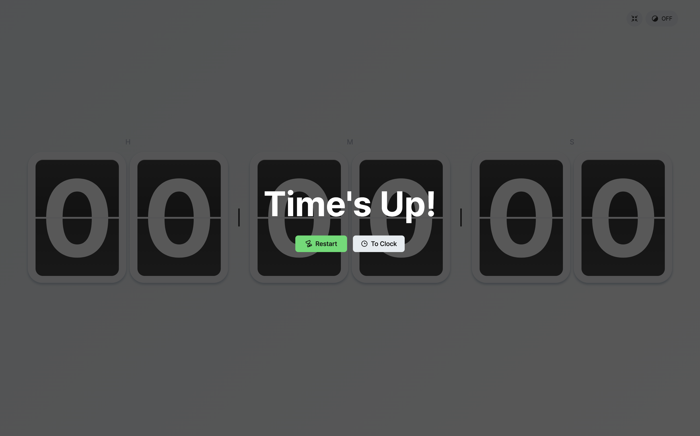
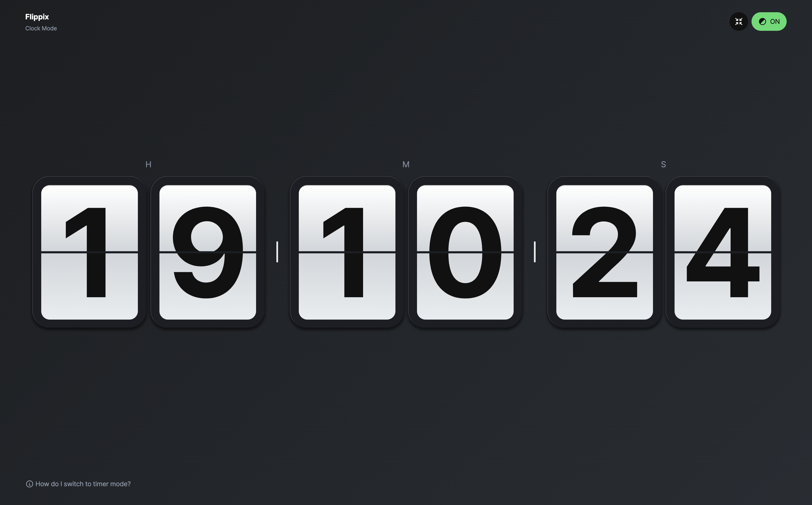
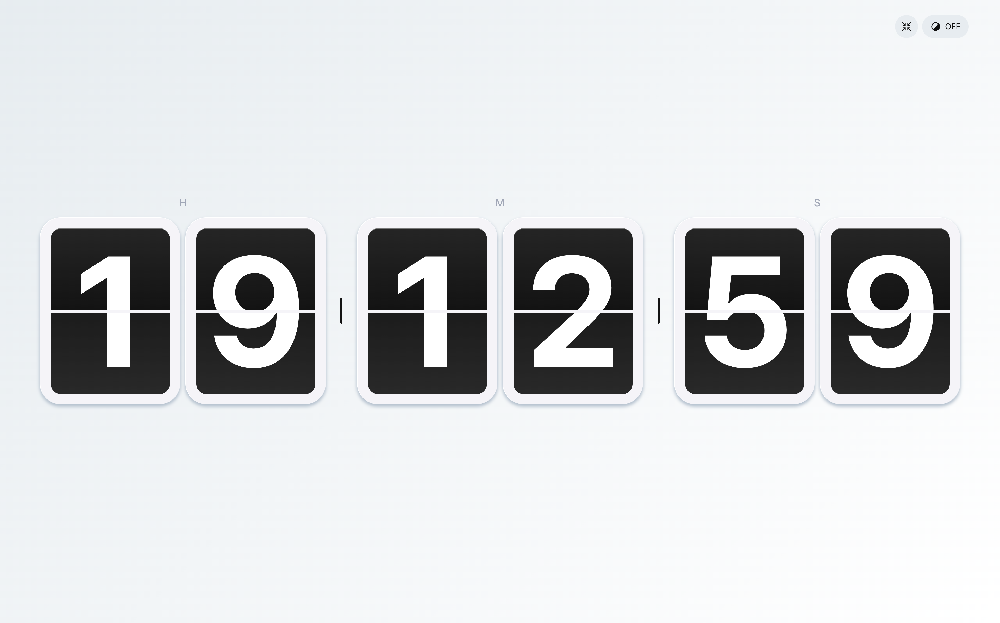
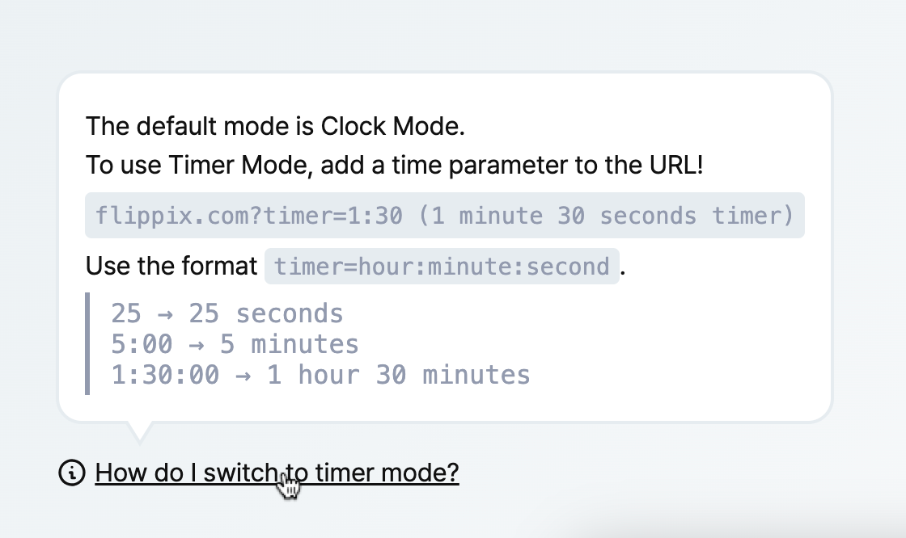
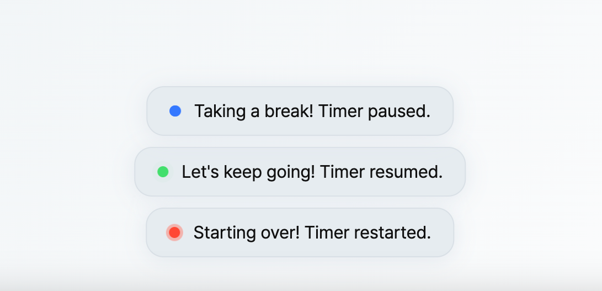

# Flippix

Flippix는 아날로그 플립 시계의 감성을 디지털로 재해석한 프로젝트입니다.  
Flip과 Pixel의 합성어인 "Flippix"는 클래식한 플립 시계 디자인을 현대적인 웹 기술로 구현하며, 시계와 타이머 기능을 모두 제공합니다.

<br/>

## 프로젝트 목적

Flippix는 **Svelte 5**를 학습하는 과정에서 소규모 토이 프로젝트로 개발되었습니다.  
디지털 플립 시계의 아날로그 감성을 현대적인 웹 환경에서 구현하는 것을 목표로 하였습니다.



<br/>

## 기술 스택

- **Framework**: Svelte 5 + SvelteKit
- **Language**: TypeScript
- **Style**: SCSS
- **State Management**: Svelte Store

<br/>

## 주요 기능

- 시계 모드 (Clock Mode)
  - 실시간 디지털 플립 시계를 제공합니다.
- 타이머 모드 (Timer Mode)
  - URL의 Query String을 통해 타이머 시간을 설정할 수 있습니다.
  - 일시정지(Pause), 재개(Resume), 재시작(Restart) 기능을 지원합니다.
  - 타이머 종료 시 자동 알림 및 후처리를 수행합니다.
  - 타이머 진행률(Progress)을 시각적으로 표시합니다.
- 다크모드 / 라이트모드 토글
  - 사용자 설정에 따라 테마를 변경할 수 있습니다.
- 버튼 인터랙션 사운드 효과
  - 주요 액션(일시정지/재개/재시작/종료) 시 짧은 사운드 효과를 제공합니다.
- 전체화면 모드 지원
  - 버튼 클릭으로 웹페이지를 전체화면으로 확장할 수 있습니다.
- Toast 메세지 알림
  - 상태 변화나 완료 이벤트 발생 시 알림 메세지를 제공합니다.

<br/>

## 기능 요약

| 기능                          | 설명                                    |
| :---------------------------- | :-------------------------------------- |
| 시계 모드 (Clock Mode)        | 현재 시간을 실시간으로 표시             |
| 타이머 모드 (Timer Mode)      | Query String을 통한 타이머 설정 및 제어 |
| 타이머 일시정지/재개/재시작   | 타이머 상태를 제어하는 버튼 제공        |
| 타이머 종료 시 처리           | 타이머 종료 후 알림 및 상태 전환        |
| 타이머 진행률 표시 (Progress) | 타이머 진행 상황을 퍼센트로 표시        |
| 다크모드/라이트모드 토글      | 사용자 테마 변경 지원                   |
| 버튼 인터랙션 사운드          | 버튼 클릭 및 주요 액션 사운드 효과 지원 |
| 전체화면 모드 (Fullscreen)    | 버튼 클릭 시 전체화면 진입/해제         |
| Toast 메세지                  | 상태 변화에 따른 알림 메세지 표시       |

<br/>

## 스크린샷

|                  시계 모드 (Clock Mode)                   |                                                       타이머 모드 (Timer Mode)                                                        |
| :-------------------------------------------------------: | :-----------------------------------------------------------------------------------------------------------------------------------: |
|  |  <br/> 타이머 모드에서는 진행률, 일시정지/재개/재시작 컨트롤러를 제공합니다. |

|                                                 타이머 종료(Timeover)                                                 |                                            다크 모드 (Dark Mode)                                             | 전체화면 모드 (Fullscreen Mode)                                                                                         |
| :-------------------------------------------------------------------------------------------------------------------: | :----------------------------------------------------------------------------------------------------------: | ----------------------------------------------------------------------------------------------------------------------- |
|  <br/> 타이머 종료 시 재시작, 시계모드 전환 버튼을 제공합니다. |  <br/> 우측 상단 토글 버튼을 통해 전환할 수 있습니다. |  <br/> 전체화면에서는 정보성 UI나 로고 등을 미노출합니다. |

|                                                            가이드 (Guide)                                                            |                                                    Toast Message                                                    |
| :----------------------------------------------------------------------------------------------------------------------------------: | :-----------------------------------------------------------------------------------------------------------------: |
|  <br/> 시계모드에서는 타이머로 전환하는 가이드(호버시 노출)를 제공합니다. |  <br/> 버튼 클릭 시 화면의 하단에 Toast 메세지를 제공합니다. |

<br/>

## 프로젝트 실행

```bash
# 의존성 설치
npm install

# 개발 서버 실행
npm run dev

# 배포용 빌드
npm run build

```

<br/>

## 타이머 설정 방법

URL에 `?timer=1:30:00` 과 같은 Query String을 추가하여 타이머를 설정할 수 있습니다.

예시: `https://flippix.vercel.app/?timer=1:30:00`

<br/>
## TODO

- [ ] 추후 타이머 설정 인터페이스 제작 고려
- [ ] 코드 리팩토링
